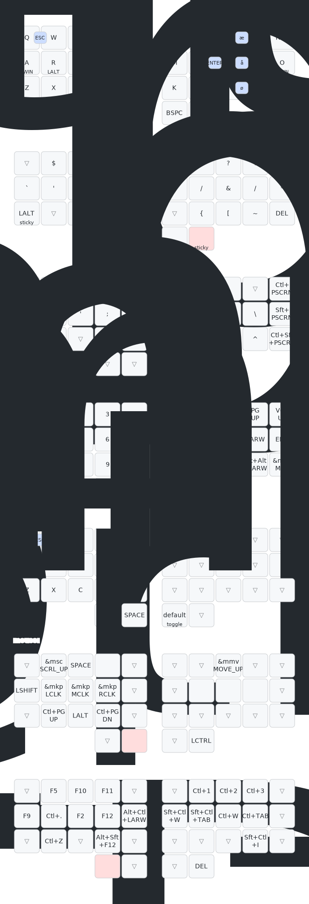

# ZMK configuration for Ferris Sweep with dongle - "Sweeple"

This is my configuration with 3 Nice!Nanos: One connected through usb working as a dongle, and one for each keyboard split.

Using a colemak-dh with danish letters layout.

Layout:

